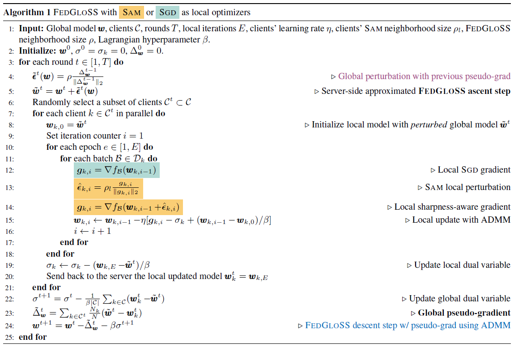

# Beyond Local Sharpness: Communication-Efficient Global Sharpness-aware Minimization for Federated Learning

This repository contains the official implementation of
> Caldarola, D., Cagnasso, P., Caputo, B., & Ciccone, M.
> _"Beyond Local Sharpness: Communication-Efficient Global Sharpness-aware Minimization for Federated Learning"_,
> IEEE/CVF 2025.

[ [ArXiv](https://arxiv.org/abs/2412.03752) ] [ [Bibtex](#bibtex-citation) ]

## Abstract
Federated learning (FL) enables collaborative model training with privacy preservation. Data heterogeneity across edge devices (clients) can cause models to converge to sharp minima, negatively impacting generalization and robustness. Recent approaches use client-side sharpness-aware minimization (SAM) to encourage flatter minima, but the discrepancy between local and global loss landscapes often undermines their effectiveness, as optimizing for local sharpness does not ensure global flatness.  
This work introduces **FedGloSS** (**Fed**erated **Glo**bal **S**erver-side **S**harpness), a novel FL approach that prioritizes the optimization of global sharpness on the server, using SAM. To reduce communication overhead, FedGloSS cleverly approximates sharpness using the previous global gradient, eliminating the need for additional client communication. Our extensive evaluations demonstrate that FedGloSS consistently reaches flatter minima and better performance compared to state-of-the-art FL methods across various federated vision benchmarks.

<p align="center">
  
  
</p>

GIFs comparing FedGloSS loss landscape (net) against those of two well-known methods (solid), FedAVG on the left and FedSAM on the right. ResNet18 trained on CIFAR10 ($\alpha = 0.05$).

## Algorithm
**FedGloSS** proposes to apply SAM on the server side, while promoting consistency between local and global models by applying Alternating Direction Method of Multipliers (ADMM). Here, is the Algorithm that sumarizes the FedGloSS showing an example with both SAM and SGD (achievable by setting $\rho_l = 0$) on the client.

<p align="center">
  
</p>

## Experiments

### Setup
#### Environment
Set up the environment and install the required dependencies:
```bash
python -m venv ../fgvenv
source ../fgvenv/bin/activate
pip install -r requirements.txt -f https://download.pytorch.org/whl/torch_stable.html
```

#### Download the provided datasets
After activating the environment, you can download and prepare the datasets using the provided script:
```bash
cd data
chmod +x setup_datasets.sh
./setup_datasets.sh
```

### Datasets
The provided datasets are CIFAR10 and CIFAR100. Both datasets are split equally among 100 clients, with varying degrees of heterogeneity controlled by Dirichlet's concentration parameter $\alpha$. The available splits are:

- CIFAR10: $\alpha \in \{0, 0.05, 1, 5, 10, 100\}$
- CIFAR100: $\alpha \in \{0, 0.5, 1000\}$

To add a new dataset, place the raw data in `/data/{dataset_name}/raw/`. Client-specific training splits should correspond to a Dirichlet concentration parameter and be stored in `/data/{dataset_name}/train/` using the naming convention: `federated_train_alpha_{alpha_value}.json`. The test split should be placed in `/data/{dataset_name}/test/test.json`. Please add the dataset name to the list `DATASETS` in `/models/utils/args.py`. Ensure `{dataset_name}` matches the `--dataset` parameter when running an experiment.

### Models
The provided model is a CNN inspired by the LeNet-5 architecture. It consists of:

- Two convolutional layers (64 channels, $5 \times 5$ kernels), each followed by a $2 \times 2$ max-pooling layer.
- Two fully connected layers with 384 and 192 units.
- A final output layer adjusted to the dataset's number of classes.

The implementation is available in `/models/{dataset}/cnn.py`.

To add a new model, place its implementation in `/models/{dataset_name}/{model_name}.py`. Ensure `{model_name}` matches the `--model` parameter when running an experiment.

### CLI args
The table below reports the arguments that can be used to run experiments with this repository.

| Argument Name        | Description                                                            | Default Value |
|----------------------|------------------------------------------------------------------------|:-------------:|
| `--dir`              | Root directory where the `/results` folder will be created             |       `.`     |
| `--dataset`          | Dataset name used in the experiment                                    |               |
| `--dir-alpha`        | Dirichlet distribution concentration parameter                         |               |
| `--model`            | Model name used in the experiment                                      |     `cnn`     |
| `-T`                 | Total number of experiment rounds                                      |               |
| `--eval-every`       | Evaluation interval (in rounds)                                        |               |
| `--C-t`              | Number of clients selected per round                                   |               |
| `--algorithm`        | Server-side algorithm                                                  |   `fedgloss`  |
| `--client-algorithm` | Client-side algorithm                                                  |   `fedgloss`  |
| `--seed`             | Random seed for reproducibility                                        |       0       |
| `--server-opt`       | Server optimizer (FedOpt)                                              |     `sgd`     |
| `--server-lr`        | Learning rate for the server optimizer                                 |               |
| `--server-momentum`  | Momentum for the server optimizer                                      |       0       |
| `--batch-size`       | Batch size for local training                                          |       64      |
| `-E`                 | Number of local training epochs                                        |       1       |
| `--lr`               | Learning rate for local training                                       |               |
| `--weight-decay`     | Weight decay for local training                                        |       0       |
| `--momentum`         | Momentum for local training                                            |       0       |
| `--device`           | Device used for running the experiment                                 |    `cuda:0`   |
| `--rho-l`            | Local SAM (Sharpness-Aware Minimization) parameter                     |               |
| `--eta`              | Learning rate adjustment factor for local SAM                          |               |
| `--rho`              | Server-side SAM parameter                                              |               |
| `--beta`             | Hyperparameter for Lagrangian optimization                             |               |
| `--T-s`              | Number of rounds for rho scheduling                                    |       0       |
| `--rho0`             | Initial rho value for scheduling                                       |     0.001     |
| `--no-eigs`          | Disables the computation of eigenvalues at the end of training         |               |
| `--plots`            | Plots the accuracy and loss trends in the results directory            |               |

### Results
The execution generates the following output files:
- `{--dir arg value}/results/[YYYY][mm][dd]_[HH]:[MM]:[SS]/params.text`: Summary of the parameters used for the run.
- `{--dir arg value}/results/[YYYY][mm][dd]_[HH]:[MM]:[SS]/trends.csv`: Results in terms of accuracy, global model norm, and pseudo-gradient norm.
- `{--dir arg value}/results/[YYYY][mm][dd]_[HH]:[MM]:[SS]/eigs.txt`: First five eigenvalues and the ratio between the first and fifth eigenvalue.
- `{--dir arg value}/results/[YYYY][mm][dd]_[HH]:[MM]:[SS]/logs.txt`: A file that reports all the lines printed on the terminal during the training.
- `{--dir arg value}/results/[YYYY][mm][dd]_[HH]:[MM]:[SS]/accuracy.pdf`: A PDF representing the accuracy trend during the experiment.
- `{--dir arg value}/results/[YYYY][mm][dd]_[HH]:[MM]:[SS]/loss.pdf`: A PDF representing the loss trend during the experiment.
- `{--dir arg value}/[YYYY][mm][dd]_[HH]:[MM]:[SS]/checkpoints/`: Contains some checkpoints saved during training.

### Examples
Below are examples of how to run experiments as described in the paper. The heterogeneity level can be adjusted using the `--dir-alpha` parameter.

#### CIFAR10
```bash
python main.py --dataset cifar10 --dir-alpha 0 --where-loading init --model cnn -T 10000 --eval-every 100 --C-t 5 --algorithm fedgloss --seed 0 --server-opt sgd --server-lr 1 --server-momentum 0 --batch-size 64 -E 1 --lr 0.01 --weight-decay 0.0004 --momentum 0 --device cuda:0 --rho-l 0.15 --eta 0 --beta 10 --rho 0.15 --T-s 2000 --plots
```

#### CIFAR100
```bash
python main.py --dataset cifar100 --dir-alpha 0 --where-loading init --model cnn -T 20000 --eval-every 100 --C-t 5 --algorithm fedgloss --seed 0 --server-opt sgd --server-lr 1 --server-momentum 0 --batch-size 64 -E 1 --lr 0.01 --weight-decay 0.0004 --momentum 0 --device cuda:0 --rho-l 0.2 --eta 0 --beta 100 --rho 0.01 --T-s 15000 --plots
```

## Bibtex citation
```text
@inproceedings{caldarola2025beyond,
  title={Beyond Local Sharpness: Communication-Efficient Global Sharpness-aware Minimization for Federated Learning},
  author={Caldarola, Debora and Cagnasso, Pietro and Caputo, Barbara and Ciccone, Marco},
  booktitle={Compuer Vision and Pattern Recognition}
}
```

## Acknowledgements
This repository builds upon the following projects:  
- [`debcaldarola/fedsam`](https://github.com/debcaldarola/fedsam/tree/master) – the foundation for the main codebase.  
- [`noahgolmant/pytorch-hessian-eigenthings`](https://github.com/noahgolmant/pytorch-hessian-eigenthings) – used as a reference for the spectral analysis implementation in `/models/eigenthings/`.  
- [`tomgoldstein/loss-landscape`](https://github.com/tomgoldstein/loss-landscape) – the basis for the landscape visualization code.
